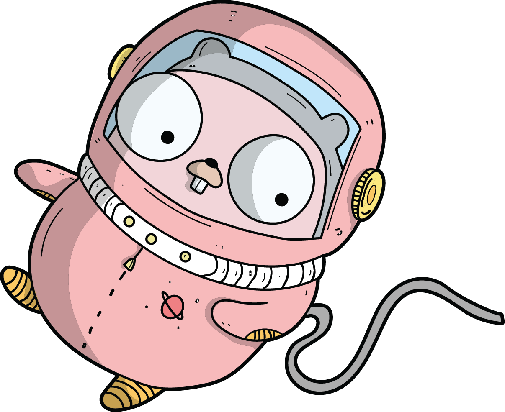

Hi 👋 Welcome to my workspace!

I am a Software Engineer with a solid background in Computer Science and a hands-on experience building reliable and efficient software.
I currently work on backend systems at my job and specialize in the same, though in my free time, I like to dabble into everything from systems programming to the frontend.

Lately I have started enjoying network programming a lot thanks to Golang.

I value knowing my tools inside out and tend to use software that allow me to do so. I am also a huge advocate for open-source and self hosting (little ironic I know, you are reading this on GitHub, but I am working on building my own git server).

## My Goals - A few things I am working on
- Writing a window manager
- Building my own linux distro
- LFS

